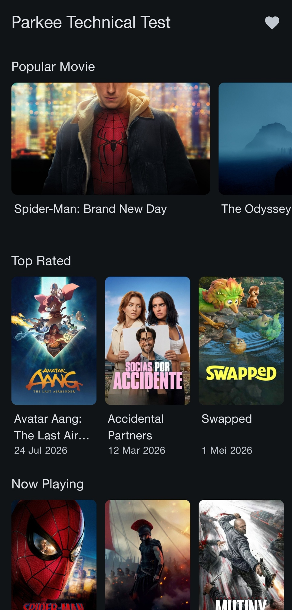
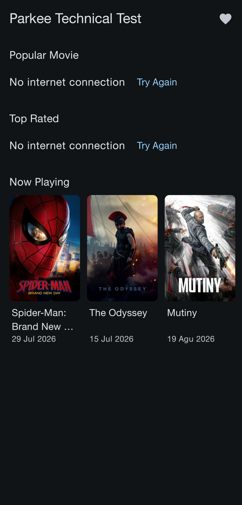
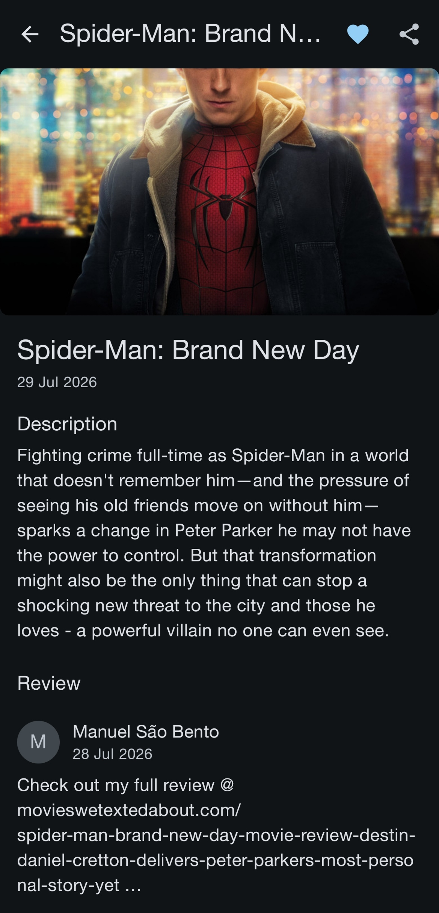
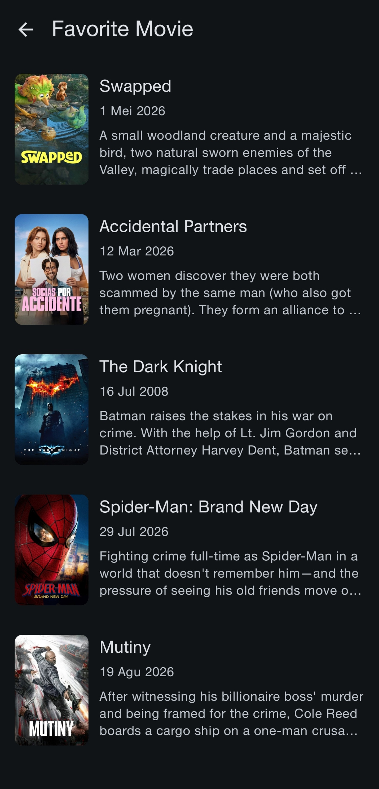

# Movie App

Movie catalog Android app built for the Android Engineer technical test, using the TMDB API.


## Screenshots

| Home                          | Home (partial failure)                                 | Detail                            | Favorites                              |
|-------------------------------|--------------------------------------------------------|-----------------------------------|----------------------------------------|
|  |  |  |  |

The second screenshot is the one worth looking at: one section failed, the other two rendered
normally, and only the failed section shows a retry.
See [Key design decisions](#key-design-decisions).

## Getting started

1. Clone the repository.
2. Create a `local.properties` file in the project root (it is gitignored).
3. Add your TMDB v4 read access token:

   ```properties
   TMDB_ACCESS_TOKEN=your_v4_read_access_token_here
   ```

   Get one from [themoviedb.org](https://www.themoviedb.org) → Settings → API. The registration page
   is not mobile-friendly, so use a desktop browser.

4. Build:

   ```bash
   ./gradlew assembleDebug
   ```

The project builds without a token — API calls will simply return `401`. The submitted APK already
bundles one, so it can be installed and tested without registering.

## Requirements coverage

| #       | Requirement                                     | Status                                     |
|---------|-------------------------------------------------|--------------------------------------------|
| 1       | Popular movies (`/movie/popular`)               | Done                                       |
| 2       | Top rated (`/movie/top_rated`)                  | Done                                       |
| 3       | Now playing (`/movie/now_playing`)              | Done                                       |
| 4       | Favorite icon in toolbar → favorites list       | Done                                       |
| 5       | Reviews (`/movie/{id}/reviews`)                 | Done                                       |
| 6       | Favorite: save to and remove from local storage | Done                                       |
| 7       | Share: bottom sheet                             | Done                                       |
| 8       | Favorites list screen                           | Done                                       |
| 9       | MVVM / MVP architecture                         | MVVM + Clean Architecture                  |
| 10      | Uploaded to GitHub                              | Done                                       |
| Bonus 1 | Unit tests                                      | Done                                       |
| Bonus 2 | Dependency injection (Hilt)                     | Done                                       |
| Bonus 3 | Android Jetpack                                 | Compose, Navigation, Room, Lifecycle, Hilt |

## Architecture

MVVM with Clean Architecture layering, single Gradle module.

```
┌─────────────────────────────────────────────────┐
│  ui/            Compose screens + ViewModels    │
│                 observes StateFlow              │
└────────────────────┬────────────────────────────┘
                     │ depends on
┌────────────────────▼────────────────────────────┐
│  domain/        Models + repository interfaces  │
│                 pure Kotlin, no Android imports │
└────────────────────▲────────────────────────────┘
                     │ implements
┌────────────────────┴────────────────────────────┐
│  data/          Repository implementations      │
│                 ├── remote/  Retrofit + DTOs    │
│                 ├── local/   Room               │
│                 └── mapper/  DTO → domain       │
└─────────────────────────────────────────────────┘

  core/           network, database, designsystem, common
  di/             Hilt modules
  navigation/     type-safe routes + NavHost
```

Dependency direction is `ui → domain ← data`. The domain layer has no knowledge of Retrofit, Room,
or the Android framework, which keeps mappers and repositories testable on the JVM without
Robolectric or an emulator.

### Package structure

```
com.example.parkee/
├── core/
│   ├── common/          AppError, DataResult, date formatting
│   ├── network/         interceptor, error mapper, image URL builder
│   ├── database/        Room database
│   └── designsystem/    theme + reusable components
├── data/
│   ├── remote/          MovieApiService, DTOs
│   ├── local/           DAO, entity
│   ├── mapper/          DTO/entity → domain
│   └── repository/      repository implementations
├── domain/
│   ├── model/           Movie, MovieDetail, Review
│   └── repository/      repository interfaces
├── di/                  Hilt modules
├── navigation/          routes + NavHost
└── ui/
    ├── home/
    ├── detail/
    └── favorite/
```

**Why a single module:** the packages above already follow module boundaries, so splitting into
`:core:network`, `:feature:home` and so on is a folder move away. It was kept single-module so
reviewers can clone and build with no extra Gradle configuration surface — for a three-day exercise
the setup cost of convention plugins and a module graph outweighs the benefit.

**On use cases:** no use case layer was added. `GetPopularMoviesUseCase { repository.getPopular() }`
is a pass-through with no logic, and one per endpoint would be boilerplate rather than structure.
ViewModels depend on repository interfaces directly.

## Key design decisions

### Independent state per home section

The home screen makes three API calls. Rather than one screen-level `Loading → Success → Error`,
each section owns its state:

```kotlin
data class HomeUiState(
    val popular: SectionState = SectionState.Loading,
    val topRated: SectionState = SectionState.Loading,
    val nowPlaying: SectionState = SectionState.Loading,
)
```

The three requests run in parallel, each updating its own slice as it completes. If "Now Playing"
times out, the other two still render, and the failed section shows an inline retry that reloads
only itself.

A single monolithic `UiState` would turn any one failure into a full-screen error, discarding data
that had already loaded successfully.

The sections share a `SectionContainer` that owns the title and the loading/empty/error/retry
states, and take their success layout through a slot. That is how "Popular" renders wide 16:9
featured cards while the other two render portrait posters, without a boolean flag switching layouts
inside one component.

### Room as the single source of truth for favorites

`FavoriteRepository` exposes `Flow`, backed by Room DAO queries that return `Flow`:

```kotlin
fun observeFavorites(): Flow<List<Movie>>
fun observeIsFavorite(movieId: Int): Flow<Boolean>
suspend fun toggle(movie: Movie)
```

The detail screen combines its content state with `observeIsFavorite(id)`; the favorites list
collects `observeFavorites()`. Because every read flows from the same table, unfavoriting from the
detail screen removes the item from the list with no manual refresh, no `onResume` reload, and no
second copy of state to keep in sync.

`toggleFavorite()` writes to Room and touches no UI state at all — the change propagates back
through the Flow.

### Favorites store a full snapshot, not just an ID

`FavoriteMovieEntity` holds title, overview, image URLs, release date and rating rather than only
`movieId`, so the favorites list renders offline. Storing IDs alone would mean N network calls per
visit and an empty screen without connectivity.

Trade-off: stored data can go stale if TMDB metadata changes. Acceptable for a film catalogue, where
records rarely change after release.

### v4 Bearer token instead of an `api_key` query parameter

Authentication uses the TMDB v4 read access token in an `Authorization` header, applied centrally by
an OkHttp interceptor. Credentials in query strings tend to end up in server logs, proxy logs and
browser history; headers do not. Endpoint definitions contain no auth parameters at all.

The logging interceptor is guarded by `BuildConfig.DEBUG` so the token is never written to logcat in
a release build.

### Favorite and share actions sit in the top bar

The wireframe places them below the review section. With real data some films return dozens of
reviews, which puts those controls several screens down. Moving them into the app bar keeps them
reachable regardless of review count.

## Libraries

Library choice is part of the grading criteria, so the reasoning is spelled out.

| Need          | Choice                                  | Why                                                                                                                                                                              | Alternative considered                                                                                    |
|---------------|-----------------------------------------|----------------------------------------------------------------------------------------------------------------------------------------------------------------------------------|-----------------------------------------------------------------------------------------------------------|
| UI            | Jetpack Compose + Material 3            | Declarative UI makes state handling explicit, which suits the per-section state model. Satisfies the Jetpack bonus.                                                              | XML/Views — still valid, but more verbose for reusable state-driven components.                           |
| DI            | Hilt                                    | Required by the bonus criteria. Compile-time graph validation: a missing binding fails the build, not the user's screen.                                                         | Koin — runtime resolution, errors surface later.                                                          |
| HTTP          | Retrofit + OkHttp                       | Standard, and the interceptor model keeps auth in one place.                                                                                                                     | Ktor Client — capable, less common in this ecosystem.                                                     |
| JSON          | kotlinx.serialization                   | Compile-time codegen, no reflection, so R8 minification works without broad keep rules.                                                                                          | Gson — reflection-based, not Kotlin null-safe. Moshi + codegen would be equivalent.                       |
| Images        | Coil 3                                  | Compose-native `AsyncImage`, coroutine-based, built-in placeholder handling — which matters because `poster_path` is nullable.                                                   | Glide — View-first API, needs separate Compose integration.                                               |
| Local storage | Room                                    | Type-safe queries, and critically DAOs return `Flow`, which is what makes reactive favorites work.                                                                               | DataStore — not suited to structured collections. SharedPreferences + JSON — not reactive, not queryable. |
| Async         | Coroutines + Flow                       | Kotlin standard. Separate coroutines for the three parallel home requests; `async` for the detail/reviews pair.                                                                  | RxJava — heavier dependency, no benefit here.                                                             |
| Navigation    | Navigation Compose                      | Type-safe routes; `movieId` arrives as an `Int` with no string parsing. ViewModels scope to the back stack entry, so opening a second film cannot inherit the first one's state. | Manual state-based navigation — error-prone back stack.                                                   |
| Date handling | `java.time` via core library desugaring | Safer API than `SimpleDateFormat`, which is not thread-safe — relevant since mapping runs on parallel requests. Costs ~200 KB.                                                   | Manual string parsing — viable, since the TMDB format is fixed.                                           |
| Testing       | JUnit4 + kotlinx-coroutines-test        | `MainDispatcherRule` swaps `Dispatchers.Main` for a test dispatcher. Hand-written fakes rather than a mocking library — shorter to write and easier to read at this scale.       | MockK — useful for larger interfaces, unnecessary here.                                                   |
| Build         | Gradle version catalog                  | Centralised versions, ready for a multi-module split.                                                                                                                            | Hardcoded versions.                                                                                       |

**Deliberately not used:** Paging 3, WorkManager, DataStore, third-party shimmer libraries, and
external architecture frameworks. See [Scope](#scope).

## Scope

Deliberately excluded, with reasons:

| Not implemented                              | Reason                                                                                                                                                                                                         |
|----------------------------------------------|----------------------------------------------------------------------------------------------------------------------------------------------------------------------------------------------------------------|
| Paging 3                                     | The wireframe uses horizontal carousels; one page of 20 items is enough. Paging 3 for a carousel adds complexity and bug surface for no visible gain. It would be the right call for a vertical infinite list. |
| `/configuration` endpoint for image base URL | Technically the correct source, but it adds a request and caching logic. Base URL and sizes are constants instead.                                                                                             |
| Network response caching                     | Out of scope. Only favorites persist.                                                                                                                                                                          |

## Edge cases handled

The TMDB response has several fields that break naive parsing. All are handled in the mapper, so no
screen has to guard against them:

- `poster_path` and `backdrop_path` can be `null` — image URLs stay nullable rather than
  concatenating into a broken string; the poster component renders a placeholder.
- `backdrop_path` falls back to the poster, then to a placeholder.
- `overview` can be an empty string — replaced with a default.
- `release_date` can be an empty string, not null — parsed defensively with a fallback.
- `results` can be an empty array — renders an empty state, not an error state.
- Review `avatar_path` sometimes holds an absolute Gravatar URL prefixed with a slash — detected and
  handled separately from TMDB-hosted paths.
- Review `id` is a `String`, unlike movie IDs which are `Int`.
- Review `created_at` is a full ISO timestamp, not a date.
- Long titles are clamped to two lines with `minLines = 2`, so cards in a carousel keep a consistent
  height.
- Review bodies are clamped — some TMDB reviews run to several thousand characters.
- DTO fields carry defaults so one malformed record cannot fail an entire section; only `id` is
  strictly required.

Errors map to a single `AppError` type at the data layer, so ViewModels never see a raw `Throwable`
and the UI never sees a stack trace. Every network call is wrapped — including the mapping step, so
an unexpected payload degrades to an error state rather than a crash.

`safeApiCall` rethrows `CancellationException` rather than swallowing it, so leaving a screen
mid-request cancels cleanly instead of surfacing a spurious error.

## Testing

Unit tests were prioritised by signal rather than coverage.

**`HomeViewModelTest`** — the highest-value tests, because they verify the architecture rather than
the plumbing:

- all three sections succeed
- **one section fails while the other two still succeed** — the test that would catch a regression
  back to monolithic state
- retry reloads only the requested section, verified by call counts on the fake repository rather
  than by final state alone
- retry moves a section from error to success

**`MovieMapperTest`** — cheap tests covering the nullable-field cases above: null poster path, blank
overview, blank release date, unrecognised date format, and correct formatting of a valid date.

Repositories are injected through constructors, so tests instantiate ViewModels directly with a
hand-written fake. Hilt is only involved at runtime.

```bash
./gradlew testDebugUnitTest
```

A GitHub Actions workflow runs the unit tests and a debug build on every push and pull request, and
uploads the resulting APK as a build artifact.

## Manual QA

Verified on device before submission: airplane mode on every screen with working retry, rotation on
all three screens, repeated back-stack navigation, films with no poster, films with no reviews, very
long titles, favoriting and unfavoriting across screens, empty favorites list, dark mode, both share
options, per-section retry, and a **release build** — R8 plus serialization is a common source of
crashes that never appear in debug. It passed without additional keep rules, which is one of the
reasons kotlinx.serialization was chosen over a reflection-based parser.

## Known limitations and next steps

- **No unit tests for `FavoriteRepository`.** Testing Room's reactive behaviour needs an in-memory
  database via Robolectric or an instrumented test; verification was manual within the time budget.
  This is the first gap I would close.
- **No Compose UI tests.** Time went to ViewModel tests, which have a higher signal-to-effort ratio.
- **The release build is signed with the debug keystore** so the APK installs directly for review. A
  production build would use a dedicated release keystore kept out of the repository.
- **Fallback strings for empty data live in the mapper.** Presentation decisions ideally belong in
  the UI layer, keeping the data layer free of user-facing text — the same separation already
  applied to `AppError.toMessage()`.
- **No pull-to-refresh.** `HomeUiState` has room for an `isRefreshing` field without changing the
  screen signature.
- **Only page 1 of each endpoint is loaded**, and network responses are not cached.
- **Favorites are a snapshot** and are not refreshed if TMDB metadata changes.
- **Loading placeholders are static.** A shimmer animation would be a small addition, but a
  correctly shaped static placeholder already avoids the layout shift that a centred spinner causes.